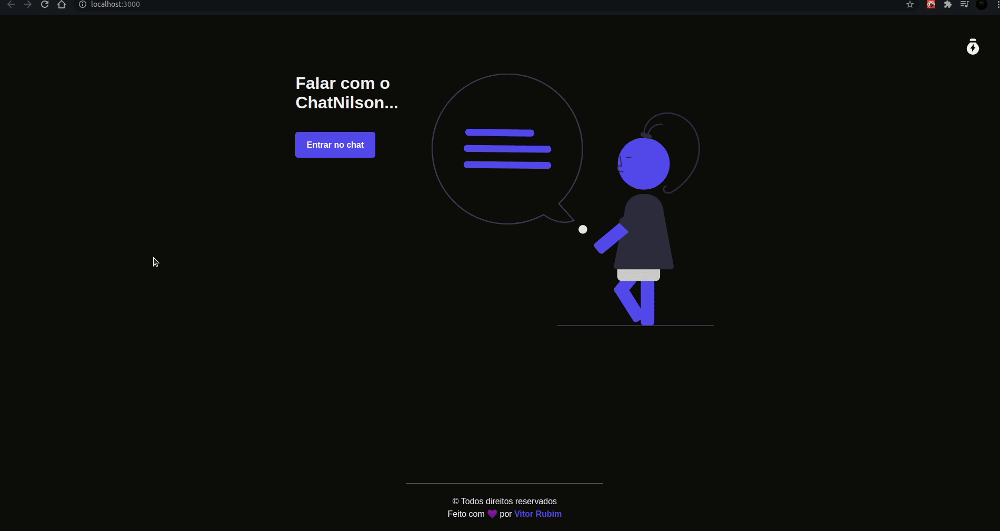

<h1 align="center">ChatNilson 🤖</h1>

## Sobre

O projeto é um chat dinâmico onde o usuário conversa com ChatNilson e responde algumas perguntas, e ao fim da conversa avalia sua experiência. E nesse projeto foi utilizado **ReactJS**, **Typescript** e **Formik** como tecnologias principais.

---

<h1 align="center">
  
</h1>


## Tecnologias utilizadas 😏

- [ReactJS](https://pt-br.reactjs.org/)
- [Styled Components](https://styled-components.com/)
- [Typescript](https://www.typescriptlang.org/)
- [SweetAlert](https://sweetalert2.github.io/)
- [Formik](https://formik.org/)

---

## 📁 Como baixar o projeto

```bash

  # Clonar o repositório 😀
  $ git clone https://github.com/vitorrubim1/chatNilson

  # Entrar no repositório 💪
  $ cd chatNilson

  # Instalar as dependências 📥
  $ yarn install ou npm i

  # Iniciar o Projeto 🔥🔥
  $ yarn start ou npm start
```

<p align="center"> Desenvolvido com ❤️ por Vitor Rubim </p>
